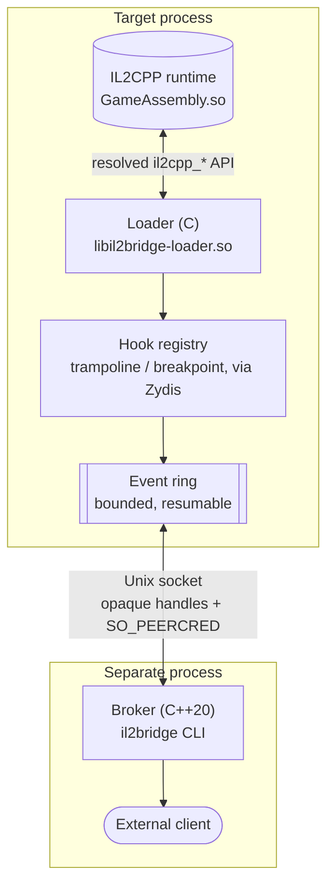

<div align="center">
  <h1>IL2Bridge</h1>
  <p><strong>C/C++20 Runtime Hooking &amp; IPC Broker for Unity IL2CPP (Linux x86-64)</strong></p>
  
  
  
  
</div>

## Overview
IL2Bridge is a research/engineering instrumentation toolkit for IL2CPP-hosted
processes on Linux x86-64. A native C loader is injected via `LD_PRELOAD` into
an already-running target; a separate C++20 broker discovers the session,
resolves managed methods by metadata token, installs reversible hooks, and
streams events over a private Unix socket.

## Architecture

* **Native Loader (C, `libil2bridge-loader.so`):**
  * `LD_PRELOAD` injection; waits for `GameAssembly.so` to be mapped, then
    resolves the IL2CPP API via `RTLD_NOLOAD`.
  * Metadata-token-based method identity, with a name/arity fallback.
* **Hooking Engine:** x86-64 trampoline and breakpoint hooks built on a
  statically-linked **Zydis** decoder to find a safely relocatable patch
  region.
* **IPC Broker (C++20, `il2bridge` CLI):** Unix-socket layer with opaque
  handles, peer-credential (`SO_PEERCRED`) validation, and a bounded,
  resumable event ring.

## How it works



## Quickstart

**1. Build the project**

```bash
cmake -S . -B build
cmake --build build -j
ctest --test-dir build --output-on-failure
```

**2. Load the loader into a target, then talk to it via the CLI**

```bash
LD_PRELOAD="$PWD/build/lib/libil2bridge-loader.so" ./TargetUnityGame.x86_64 &

./build/bin/il2bridge targets list
./build/bin/il2bridge status
./build/bin/il2bridge hook add \
    'Sample.dll!Example.Input.Controller::ValidateInput@0x06001234' \
    --mode around --handler count-calls
```
